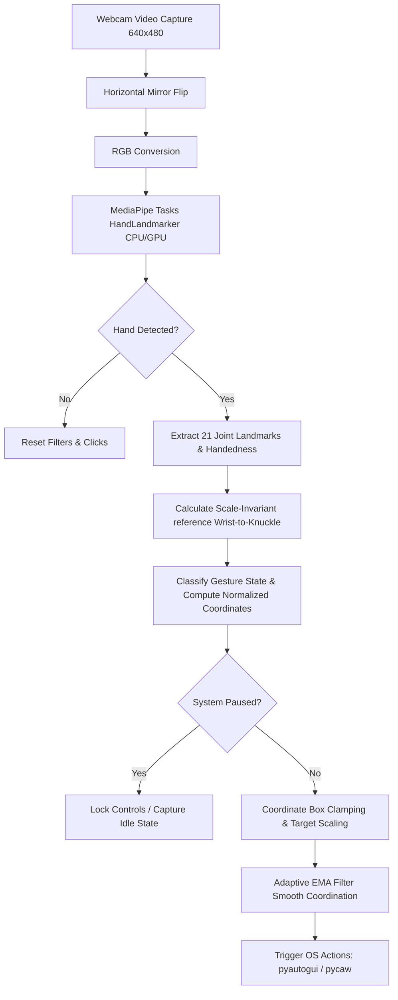

# 👁️ CyberHUD: Webcam Gesture Controller

<p align="center">
  
  
  
  
</p>

A state-of-the-art, touchless computer vision hand-tracking system that turns real-time spatial gestures into fluent operating system controls. Powered by **Google MediaPipe Tasks (TensorFlow Lite)** and optimized with an **Adaptive Exponential Moving Average (EMA) cursor filter**, CyberHUD provides pixel-perfect mouse navigation, dragging, right-clicking, scrolling, and master volume regulation using a simple webcam.

---

## ⚡ System Architecture Flow

Here is how CyberHUD processes your spatial coordinates frame-by-frame with low latency:



---

## ✨ Features

* **Adaptive Anti-Jitter Filtering**: Uses a velocity-sensitive Exponential Moving Average (EMA) filter. Heavy smoothing eliminates sensor jitter while hovering, and zero-lag response opens up during fast sweeps.
* **Scale-Invariant Interaction**: All distance thresholds (pinches, open hand triggers) are divided by a physical hand reference length (Wrist to Middle Knuckle). The system remains **100% accurate** whether you sit close to or far from your camera.
* **Futuristic Neon HUD Overlay**: OpenCV-based cyberpunk heads-up display showing dynamic tracking bounds, customized joint skeleton connectors, expanding click ripples, and interactive volume bars.
* **Drag-and-Drop Capability**: Our click state machine maps pinch-start to `mouseDown` and pinch-release to `mouseUp`. You can comfortably pinch-hold, drag folders or browser scrollbars, and release to drop.
* **Dynamic COM Monkeypatch**: Bundles a dynamic `ctypes` patching hook making the MediaPipe TensorFlow bindings completely compatible under Python 3.12, 3.13, and 3.14 on Windows.

---

## 🖐️ Gesture Vocabulary

| Gesture | Finger Layout | System Trigger | Cyber-HUD Overlay |
| :--- | :--- | :--- | :--- |
| **Cursor Hover** | **Index finger UP**, other fingers folded. | Smooth cursor tracking inside the central active bounds. | Cyan glowing crosshair tracking fingertip. |
| **Left Click / Drag** | **Pinch Thumb + Index tip** (in Cursor Mode). | Left-click down (pinch-hold to drag-and-drop folders/windows). | Expanding Cyan ripple from pinch location. |
| **Right Click** | **Pinch Thumb + Middle tip** (in Cursor Mode). | Contextual Right-Click click. | Expanding Magenta ripple from pinch location. |
| **Page Scroll** | **Index & Middle UP & Close**, others folded. | Vertical hand displacement scrolls pages smoothly. | Dual vertical scroll arrows. |
| **Volume Control** | **Index & Thumb open**, others folded. | Pinch/unpinch distance regulates master system volume. | Interactive vertical HUD progress bar & % read-out. |
| **Pause / Resume** | **Fully Open Palm** held steady for 2.0s. | Toggles gesture control ON/OFF (safety idle lock). | Circular countdown timer panel in center of HUD. |

---

## 🛠️ Installation & Setup

> [!IMPORTANT]
> **Windows OS Integration**
> Master volume binding relies on Windows Core Audio APIs (`pycaw`). For mouse navigation, the system uses cross-platform emulation via `pyautogui`.

### 1. Clone & Navigate
```powershell
git clone https://github.com/VARSHAN69/webcam-gesture-controller.git
cd webcam-gesture-controller
```

### 2. Install Dependencies
```powershell
pip install -r requirements.txt
```

### 3. Launch the Application
Run the main script with your default webcam (Index 0):
```powershell
python main.py
```

---

## ⚙️ Advanced CLI Options

CyberHUD exposes command-line arguments to quickly configure your physical setup:

```powershell
# Increase speed/sensitivity of cursor movements
python main.py --sensitivity 1.5

# Connect to an external USB camera (Camera index 1)
python main.py --camera 1

# Launch with Windows Master Volume control disabled
python main.py --no-volume
```

---

## ⚠️ Safety Fail-Safe (Emergency Abort)

The application implements PyAutoGUI's **FAILSAFE** feature. If your mouse cursor behaves erratically or gets locked in a click-state, **violently sweep your physical mouse or your hand-guided cursor to any of the four corners of your monitor**. This immediately aborts the script execution and restores regular operating system controls.

---

## 📜 Modular File Breakdown

* `config.py` — Contains coordinate tracking margins, scale thresholds, BGR colors, and visual styles.
* `filters.py` — Implements the velocity-sensitive `AdaptiveEMAFilter` for smooth coordinates.
* `gestures.py` — Classifies hand landmark geometry into gestures with scale-invariant ratios.
* `controller.py` — Manages webcam frame capturing, overlays custom skeleton drawings, and coordinates system APIs.
* `patch.py` — Monkeypatches `ctypes.CDLL` to ensure DLL compatibility on Windows under Python 3.12+.
* `main.py` — Standard CLI command handler and runtime entrypoint.

---

## 📄 License
This project is licensed under the MIT License - see the [LICENSE](LICENSE) file for details.
